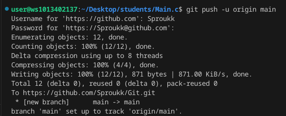
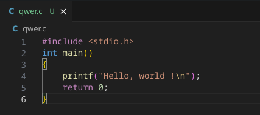
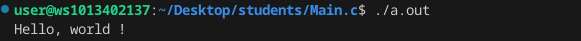
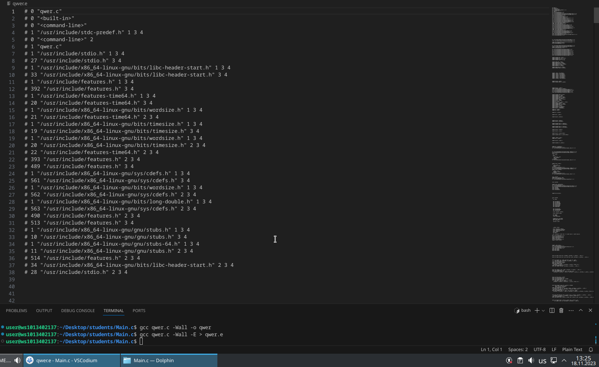
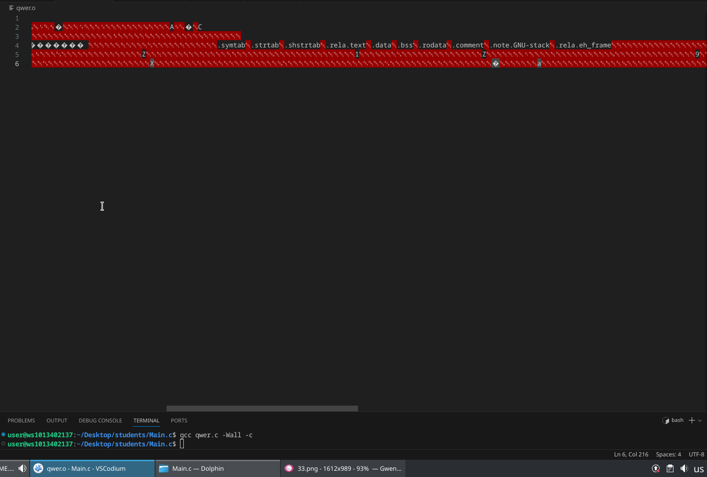

# Лабораторная работа №0
## Задание 

## 1. Ссылка на репозиторий:
https://github.com/Sproukk/Git/tree/main

## 2. Склонируйте его себе на пк:

## 3. Напишите свою первую программу:

## 4. Скомпилируйте и запустите её:

## 5. Препроцессор:

## 6. Компилятор:

